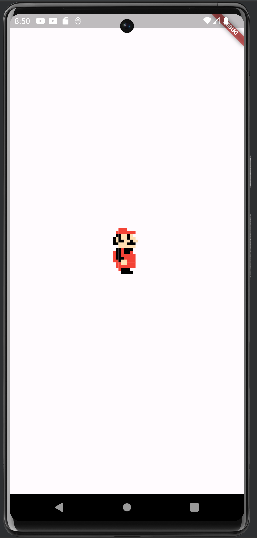

## Getting started

import package loading_redman_ddur

pub get

## Usage


'/example' folder use..
```dart
import 'package:flutter/material.dart';
import 'package:loading_redman_ddur/ManAnim.dart';

void main() {
  runApp(const MyApp());
}

class MyApp extends StatelessWidget {
  const MyApp({super.key});

  // This widget is the root of your application.
  @override
  Widget build(BuildContext context) {
    return MaterialApp(
      title: 'Flutter Demo',
      theme: ThemeData(

        colorScheme: ColorScheme.fromSeed(seedColor: Colors.deepPurple),
        useMaterial3: true,
      ),
      home: const MyHomePage(),
    );
  }
}

class MyHomePage extends StatefulWidget {
  const MyHomePage({super.key});

  @override
  State<MyHomePage> createState() => _MyHomePageState();
}

class _MyHomePageState extends State<MyHomePage> {
  @override
  Widget build(BuildContext context) {
    return Scaffold(
      body: Center(
        child: ManAnim(size: 1,),

      ),
    );
  }
}

```

## Additional information

I will make another animation 
